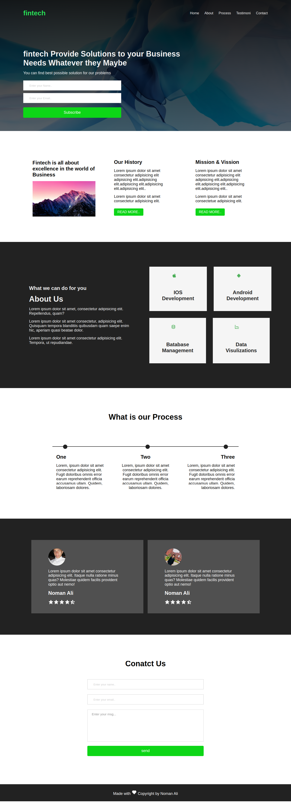

# This is Company Page Build with HTML5 and CSS3

 
1 -> HTML5
2 -> CSS#
3 -> javaScript
4 -> Responsive using Media Queries

## Authors

- [@nomankhokhar](https://www.github.com/nomankhokhar)

## Badges

## 🚀 About Me

I'm a full Stack Developer...